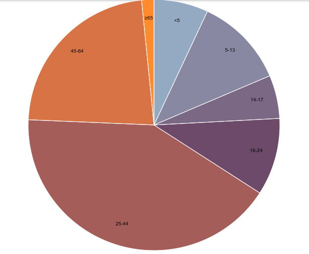
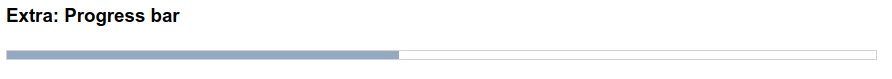
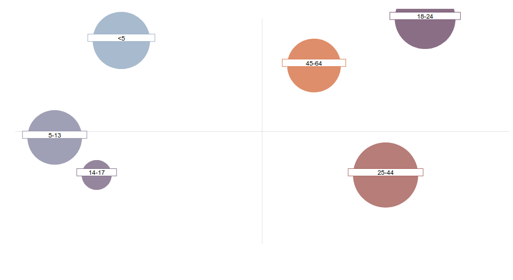
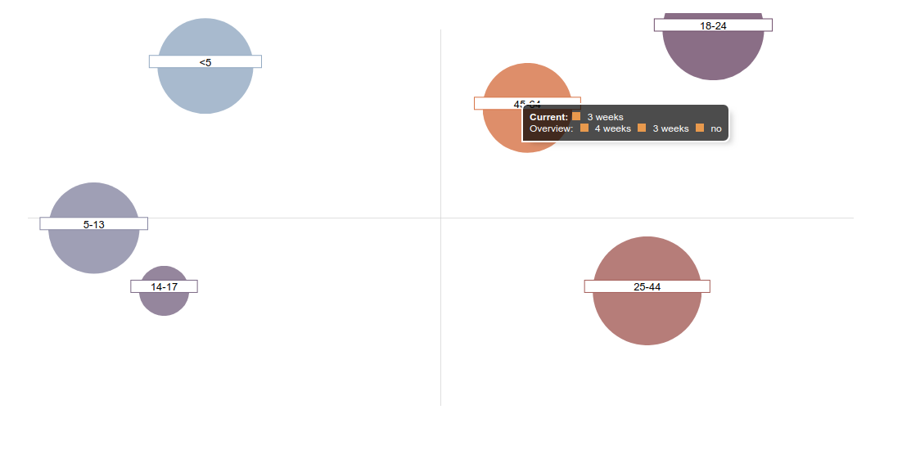

[](https://circleci.com/gh/edgarordonez/d3-stencil/tree/master) D3-Stencil
======

These D3 components have been built with [Stencil](https://github.com/ionic-team/stencil).

# Usage

  ## Install
  
  You can use these components in any framework *(Angular, React, Vue, etc.)* or if you want without any those.

  - Run `npm i d3-stencil` or put a script tag similar to this in the head of your index.

  ``` HTML
  <script src='https://unpkg.com/d3-stencil@0.0.1/dist/d3-stencil.js'></script>
  ```

  - Then you can use the element anywhere in your template, JSX, JSX, etc.

  ``` JSX
  <!-- JSX -->
  <line-chart graphData={GRAPH_DATA}></line-chart>

  <!-- Also, you have available a component for the tooltip and legend, as simple as this. -->

  <line-chart graphData={GRAPH_DATA}>
    <!-- The prop 'align' allows us to change the position of the text inside your tooltip. -->
    <tooltip-chart slot="tooltip" align={'center'}></tooltip-chart>
    <!-- See later the Legend Data Type. -->
    <legend-chart slot="legend" legendData={LEGEND_DATA}></legend-chart>
  </line-chart>
  ```

  Also, you can check the official documentation from Stencil about [Framework integration](https://stenciljs.com/docs/framework-integration)

  ## API REFERENCE

  Before use these components, you need to know that all of these accepts an object of `GraphData Type` by "props". This type defines a contract that doings your use be easy, continue reading.

  - ### GraphData

    ``` TYPESCRIPT
    type GraphData = {
      data: number[][] | BcgMatrix[]; // Array multi-dimensional with the data to paint. Can be a bidimensional array of numbers or BCG matrix.
      styles: Styles; // Styles that applies inside the graph.
      labels?: string[] | number[];
      colors?: string[];
      // Specific options.
      pieChartOptions?: PieChartOptions;
      barChartOptions?: BarChartOptions;
      lineChartOptions?: LineChartOptions;
      lineAnnotationsChartOptions?: LineAnnotationsChartOptions;
      bcgMatrixChartOption?: BcgMatrixChartOptions;
    };
    ```
  - ### Styles

    It's simple. The `Styles Type` defines some optional properties to set the `width, height, margin and padding` into your SVG.

    ``` TYPESCRIPT
    export type Styles = Partial<{
      width: string; // Feel free to put px, rem, em or %.
      height: string;
      margin: string;
      padding: string;
    }>;
    ```

  - ### Formats

    The formats for showing the data in different ways was defined with an enum. This enum defines a contract with an object where one property corresponds to a key of this enum, with this, we can set in the `GraphData` a simple way to define the format that we want and knowledge about d3-format from outside are not required.

    You can find more accurate information at:
      - [d3-format](https://github.com/d3/d3-format)
      - [d3-time-format](https://github.com/d3/d3-time-format)

    ``` TYPESCRIPT
    enum Formats {
      PERCENTAGE, //  D3 => format('.0%')
      GROUPED_TWO_DIGITS, // D3 => format('.2s')
      GROUPED_THOUSANDS_TWO_DIGITS, // D3 =>  format(',.2r')
      CURRENCY, // Return the input in the format currency that you want.
      DAY_AND_MONTH, // D3 => timeFormat('%b')
      SHORT_MONTH, // D3 => timeFormat('%B')
      LARGE_MONTH, // D3 => timeFormat('%b %d')
      ANY // Return the same input
    };

    type FormatsType =
      | Formats.PERCENTAGE
      | Formats.GROUPED_TWO_DIGITS
      | Formats.GROUPED_THOUSANDS_TWO_DIGITS
      | Formats.CURRENCY
      | Formats.DAY_AND_MONTH
      | Formats.SHORT_MONTH
      | Formats.LARGE_MONTH
      | Formats.ANY;
    ```

  - ### Axis

    `Axis Type` does be able the config for the Axis X or Y. We have some properties to set if we want the Axis visible or not, the currency if we are using the type of format also defined here, label, grid, etc.

    ``` TYPESCRIPT
    // Remember the FormatsType explained above.

    type Axis = Partial<{
      x: Partial<{
        visible: boolean;
        gridVisible: boolean;
        format: FormatsType;
        label: string;
        currency: string;
      }>;
      y: Partial<{
        visible: boolean;
        gridVisible: boolean;
        format: FormatsType;
        label: string;
        currency: string;
      }>;
    }>;
    ```

  - ### Margin


  ## Components
  
  **Ok, Let's see how to use them!**

  - ### Pie Chart

    

    Custom tag:
    ``` JSX
    <pie-chart graphData={this.GRAPH_DATA} />
    ```

    Extra options for pie-chart:

    ``` TYPESCRIPT
    /* This type gives you the options for setting your format to show on pie-chart. Both formats it'll be used to set tooltip format. */
    type PieChartOptions = Partial<{
      labelFormat: FormatsType;
      dataFormat: FormatsType;
      currency: string;
    }>;
    ```

    Example GraphData:

    ``` TYPESCRIPT
    const GRAPH_DATA: GraphData = {
      labels: ['<5', '5-13', '14-17', '18-24', '25-44', '45-64', '≥65'],
      pieChartOptions: {
        labelFormat: Formats.ANY,
        dataFormat: Formats.GROUPED_TWO_DIGITS,
      },
      styles: {
        width: '100%',
        height: '500px',
        margin: '20px 0'
      },
      colors: [
        '#98abc5',
        '#8a89a6',
        '#7b6888',
        '#6b486b',
        '#a05d56',
        '#d0743c',
        '#ff8c00'
      ],
      data: [
        [2704659, 4499890, 2159981, 3853788, 16106543, 8819342, 612463]
      ]
    };
    ```

  - ### Horizontal Bar Chart

    

    Custom tag:
    ``` JSX
    <horizontal-bar-chart graphData={this.GRAPH_DATA} />
    ```

    Extra options for bar-chart:

    ``` TYPESCRIPT
    /* This type gives you the options for setting your axis and margins in your bar-chart. */
    type BarChartOptions = Partial<{
      axis: Axis;
      margin: Margin;
    }>;
    ```

    Example GraphData:

    ``` TYPESCRIPT
    const GRAPH_DATA: GraphData = {
      labels: ['<5', '5-13', '14-17', '18-24', '25-44', '45-64', '≥65'],
      barChartOptions: {
        axis: {
          x: {
            format: Formats.CURRENCY,
          },
        },
        margin: {
          top: 0,
          right: 0,
          bottom: 0,
          left: 0,
        },
      },
      styles: {
        width: '100%',
        height: '500px',
        margin: '20px 0'
      },
      colors: [
        '#98abc5',
        '#8a89a6',
        '#7b6888',
        '#6b486b',
        '#a05d56',
        '#d0743c',
        '#ff8c00'
      ],
      data: [
        [1250, 200, 20, 140, 600, 3002, 5985]
      ]
    };
    ```

    *Extra:*

    With the Axis and Margin types we can use Bar Chart for creating a simple progress bar, for example:

    

    Example GraphData:

    ``` TYPESCRIPT
    import { GraphData, Formats } from 'd3-stencil';

    GRAPH_DATA: GraphData = {
      labels: ['<5'],
      barChartOptions: {
        axis: {
          x: {
            visible: false,
            gridVisible: false,
          },
          y: {
            gridVisible: false,
          },
        },
        margin: {
          top: 20,
          bottom: 20,
        },
      },
      styles: {
        width: '100%',
        height: '10px',
      },
      colors: [
        '#98abc5',
      ],
      data: [
        [45],
      ]
    };
    ```

  - ### Line Chart

    

    Custom tag:
    ``` JSX
    <line-chart graphData={this.GRAPH_DATA} />
    ```

    Extra options for line-chart:
    ``` TYPESCRIPT
    /* This type gives you options for setting your axis and margins in your line-chart. */
    type LineChartOptions = Partial<{
      axis: Axis,
      margin:Margin,
    }>;
    ```

    Example GraphData:
    ``` TYPESCRIPT
    import { GraphData, Formats } from 'd3-stencil';

    const GRAPH_DATA: GraphData = {
      labels: [1496354400, 1496440800, 1496527200, 1496613600, 1496700000, 1496786400, 1496872800],
      lineChartOptions: {
        axis: {
          x: {
            format: Formats.DAY_AND_MONTH,
            label: 'Days',
          },
          y: {
            format: Formats.GROUPED_TWO_DIGITS,
            label: 'Quantity',
          },
        },
        margin: {
          top: 20,
          right: 30,
          bottom: 50,
          left: 60,
        },
      },
      styles: {
        width: '100%',
        height: '500px',
        margin: '20px 0',
      },
      colors: [
        '#98abc5',
        '#8a89a6',
      ],
      data: [
        [2704659, 4499890, 2159981, 3853788, 16106543, 8819342, 612463],
        [1004659, 2499890, 1159981, 2853788, 14106543, 6819342, 412463],
      ]
    };
    ```

  - ### Line Chart Annotations

    

    Line Chart Annotations are using a simple line chart inside, but with a new type of options, we can extend his functionality.

    Custom tag:
    ``` JSX
    <line-annotations-chart graphData={this.GRAPH_DATA} />
    ```

    Extra options for line-chart-annotations:
    ``` TYPESCRIPT
    type LineAnnotationsChartOptions = {
      increaseHeight: number; // Size in pixels that increase the SVG content.
      tickSeparation: string; // Set px, em, or rem to move the positions of ticks.
      annotations: number[][]; // Annotations are a bidimensional array that has relation to x labels position
      imagePathOneAnnotation?: string; // path to image when we have single annotation
      imagePathSomeAnnotations?: string; // path to image when we have more than one annotation
    };
    ```

    Example GraphData:
    ``` TYPESCRIPT
    import { GraphData, Formats } from 'd3-stencil';

    GRAPH_DATA: GraphData = {
      labels: [1496354400, 1496440800, 1496527200, 1496613600, 1496700000, 1496786400, 1496872800],
      lineChartOptions: {
        axis: {
          x: {
            format: Formats.DAY_AND_MONTH,
          },
          y: {
            format: Formats.GROUPED_TWO_DIGITS,
          },
        },
        margin: {
          top: 20,
          right: 40,
          bottom: 50,
          left: 40,
        },
      },
      lineAnnotationsChartOptions: {
        increaseHeight: 15,
        tickSeparation: '2.5em',
        annotations: [
          [1],
          [2],
          [],
          [],
          [4, 5],
          [],
          [],
        ],
      },
      styles: {
        width: '100%',
        height: '500px',
        margin: '40px 0',
      },
      colors: [
        '#98abc5',
        '#8a89a6',
      ],
      data: [
        [2704659, 4499890, 2159981, 3853788, 16106543, 8819342, 612463],
        [1004659, 2499890, 1159981, 2853788, 14106543, 6819342, 412463],
      ]
    };
    ```

  - ### Bcg Matrix Chart

    

    [More info about this Graph](https://en.wikipedia.org/wiki/Growth%E2%80%93share_matrix)

    Custom tag:
    ``` JSX
    <bcg-matrix-chart graphData={this.GRAPH_DATA} />
    ```

    Bcg Matrix Chart has your type that includes some properties to make possible this Chart. Those properties are the next:

    ``` TYPESCRIPT
    type BcgMatrix {
      x_data: number; // Data that represents axis x of Graph.
      y_data: number; // Data that represents axis y of Graph.
      rel_size: number; // Data to represent the size of your bubbles in the Graph. It can be sales, visits or however you want to be represented in your graph.
      /**
      * In this chart, the label and data come inside the object. 
      * This not happens in other graphs, but I thought that this approach is the more straightforward for this graph when each bubble depends on a category.
      */
      label: string;  
      color: string;
      tooltipInfo?: string; // Inside this property, you can write JSX and will show in the tooltip.
    };
    ```

    Extra options for bcg-matrix-chart:

    ``` TYPESCRIPT
    // Those options are very similar to `LineChartOptions` just I added two new options. "Quadrants" this option is to decide if the quadrants that divide the graph between a dog, question mark, star and cash cows are visible or not, and format and currency of data to show. 
    type BcgMatrixChartOptions = Partial<{
      axis: Axis,
      quadrants: boolean,
      value: Partial<{
        format: FormatsType,
        currency: string;
      }>
      margin: Margin;
    }>;
    ```

    Example GraphData:

    ``` TYPESCRIPT
    import { GraphData, Formats } from 'd3-stencil';

    const GRAPH_DATA: GraphData = {
      bcgMatrixChartOption: {
        axis: {
          y: {
            format: Formats.PERCENTAGE,
          },
        },
        value: {
          format: Formats.GROUPED_TWO_DIGITS,
        },
        margin: {
          top: 20,
          right: 40,
          bottom: 20,
          left: 40,
        },
      },
      styles: {
        width: '100%',
        height: '500px',
        margin: '20px 0',
      },
      data: [
        {
          x_data: 0.43,
          y_data: 0.65,
          rel_size: 648860,
          label: '<5',
          color: '#98abc5',
          tooltipInfo: `<b>Current:</b><div class="square"></div> 3 weeks<br>Overview: <div class="square"></div> 4 weeks <div class="square"></div> 3 weeks <div class="square"></div> no`
        },
        {
          x_data: 0.16,
          y_data: 0.34,
          rel_size: 588399,
          label: '5-13',
          color: '#7b6888',
          tooltipInfo: `<b>Current:</b><div class="square"></div> 3 weeks<br>Overview: <div class="square"></div> 4 weeks <div class="square"></div> 3 weeks <div class="square"></div> no`
        },
        {
          x_data: 0.33,
          y_data: 0.22,
          rel_size: 177443,
          label: '14-17',
          color: '#7b6888',
          tooltipInfo: `<b>Current:</b><div class="square"></div> 3 weeks<br>Overview: <div class="square"></div> 4 weeks <div class="square"></div> 3 weeks <div class="square"></div> no`
        },
        {
          x_data: 1.66,
          y_data: 0.72,
          rel_size: 729405,
          label: '18-24',
          color: '#ff8c00',
          tooltipInfo: `<b>Current:</b><div class="square"></div> 3 weeks<br>Overview: <div class="square"></div> 4 weeks <div class="square"></div> 3 weeks <div class="square"></div> no`
        },
        {
          x_data: 1.50,
          y_data: 0.22,
          rel_size: 838025,
          label: '25-44',
          color: '#d0743c',
          tooltipInfo: `<b>Current:</b><div class="square"></div> 3 weeks<br>Overview: <div class="square"></div> 4 weeks <div class="square"></div> 3 weeks <div class="square"></div> no`
        },
        {
          x_data: 1.21,
          y_data: 0.85,
          rel_size: 269605,
          label: '45-64',
          color: '#ff8c00',
          tooltipInfo: `<b>Current:</b><div class="square"></div> 3 weeks<br>Overview: <div class="square"></div> 4 weeks <div class="square"></div> 3 weeks <div class="square"></div> no`
        },
        {
          x_data: 1.21,
          y_data: 0.57,
          rel_size: 569985,
          label: '≥65',
          color: '#ff8c00',
          tooltipInfo: `<b>Current:</b><div class="square"></div> 3 weeks<br>Overview: <div class="square"></div> 4 weeks <div class="square"></div> 3 weeks <div class="square"></div> no`
        },
      ],
    };
    ```

    Example tooltip on Bcg Matrix chart with JSX of tooltipInfo property

    

  ## Slots Components

  - ### Tooltip

    The Tooltip is a component that you can put inside another with an attribute `slot="tooltip"`. It has an optional prop for aligning the text into it.

    The tooltip display information related to current data graph. For example on pie-chart will show the value of data. The data will be formatted in the format indicated before in pie chart options. Exist particular cases as BCGMatrix Chart where the JSX can be from outside.

    Custom tag:
    ``` JSX
    <tooltip-chart slot="tooltip" align={'left'} />
    ```

  - ### Legend

    Legend is a component that you can put inside another with an attribute `slot="legend"` and prop legendData of type LegendData.

    Custom tag:
    ``` JSX
     <legend-chart slot="legend" legendData={this.LEGEND_DATA_LINE} />
    ```

    Legend accepts a prop of LegendData type. It has labels to print, colour to associate with data and a property that defines if the legend is horizontal or vertical.

    ``` TYPESCRIPT
    type LegendData = Partial<{
      labels: string[];
      colors: string[];
      type: 'horizontal' | 'vertical';
      styles: Styles;
    }>;
    ```

  ## TIPS

  - If you've read all the options on the different charts, you can see that it has many options, but this reason the graph creates a deep copy or merge with default data and the data introduced. Therefore, you can set a GraphData object with the properties you want to change and leave other options by default. [See GraphData by default](https://github.com/edgarordonez/d3-stencil/blob/master/src/shared/default-graph-data.ts)

  - If you need more information about options, you can read [Interfaces/Types](https://github.com/edgarordonez/d3-stencil/tree/master/src/interfaces)

# Contribute

  I'm writing another readme about how to contribute to this project. For now, you can fork this repository and check the code, and if you want to add another graph feel free to open an Issue/PR.

  The main intention for me was to find a simple way to add a custom element and render a Graph agnostic of frameworks, also have a structure to draw many types of Graphs with a similar kind of object whenever possible.

  If you think that we can improve the desing of this components, please, contact me.

  - Run project on local `yarn && yarn dev`

  - Run test `yarn test`
  
  - Create build for production `yarn build`

  In case that you would like to contribute, check the commit message convention [here](https://gist.github.com/stephenparish/9941e89d80e2bc58a153) and [commitizen](https://github.com/commitizen/cz-cli)
